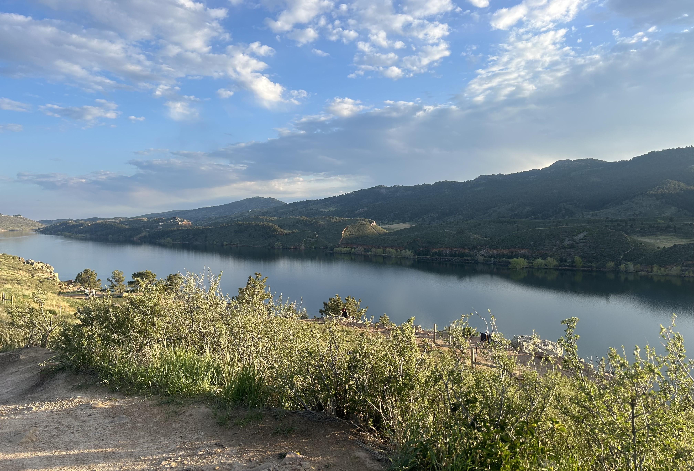
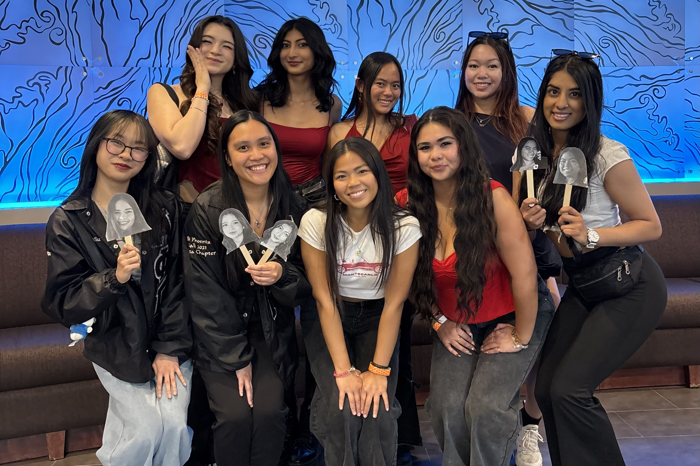
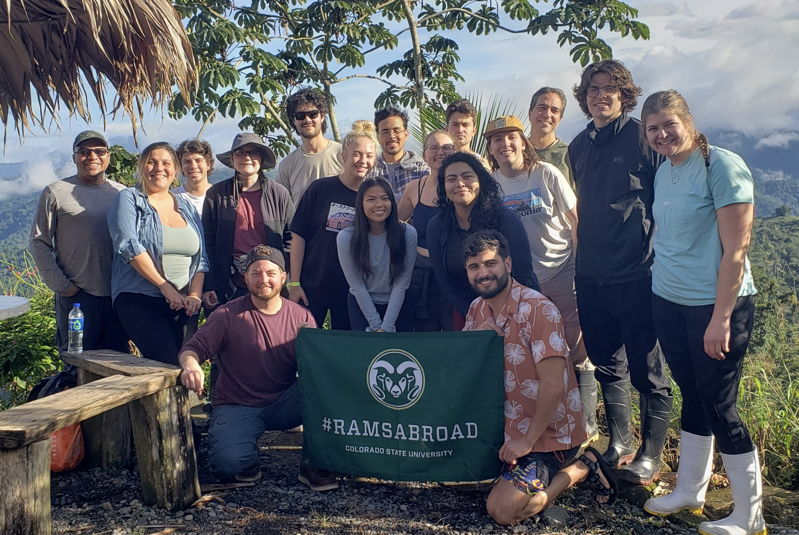

#### Personal Statement

I'm an emerging graduate student at Colorado State University in the Department of Ecosystem Science and Sustainability. In their Professional Science Masters (PSM) program, I've developed the necessary skills to navigate the greenhouse gas policy landscape, estimate emissions for entities at all scales, and assess vulnerabilities in a rapidly changing world. With my supplemental Carbon Management certificate, I am passionate about quantifying the impacts of climate risks for place-based, equitable solutions that decarbonize the economy.

------------------------------------------------------------------------

#### Beyond My Work

When I'm not studying, I enjoy hanging out in the sun, getting involved in my community, and exploring the world! Understanding the cultural, provisional, and regulating services our ecosystems offer is important to me as I work to bridge the gap between communal needs and natural resources. I am inspired by the relationships and experiences we share in my sustainability career.

{alt="My hiking view at a local state park near Fort Collins." fig-align="center"}

{fig-align="center"}

{fig-align="center"}
